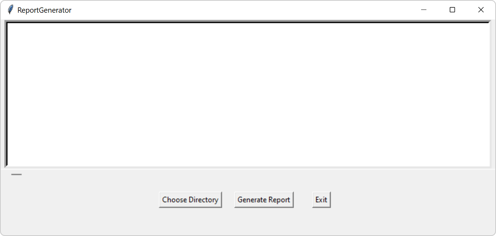

# AutomaticScript
## Intent
Lab produced test  data when finished validating a game. Generally, AE parsed those data manually to generate a report. It will be better if there is automatic tool to parse them to get rough result and create a test report. 
So I implement a tool called ‘test report generator’ using python script which can create a word doc including all test cases information extracted from a test, as well as table and charts illustrating performance data on different platforms. 
## Usage 
### Step1 
Run the tool by double clicking exe file and UI will be popped up.
 
### Step2
Click button ’Choose directory’ here the directory is the folder storing test data per case on GEDB. The directory can be found in ‘Server Path for User’ widget on GEDB. 
### Step 3
Copy path stored test data in the folder input widget and select folder. Then all cases will be listed in the list box as below.  
 
### Step 4
Choose any case which you want to generate test report according to. And then click button ‘Generate Report’
### Step 5
The status will be shown at the bottom of UI when waiting for the report.
### Step 6
Report will be saved as in the same folder as exe file. 
